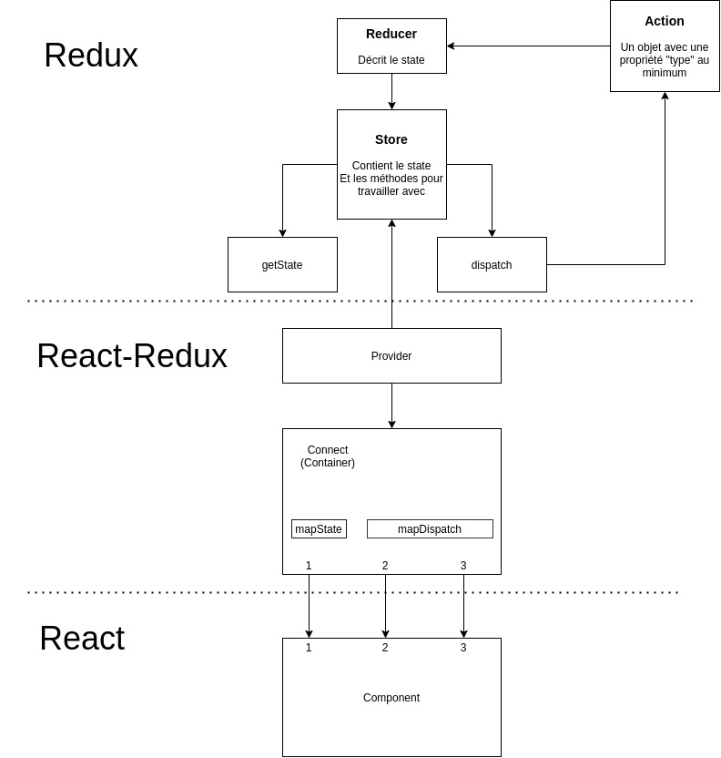

# Methodo React et Redux

## React

- Je crée les composants avec juste un texte
- Je les affiche
- Je complète leur affichage HTML / CSS
- Je crée les props
- Je leur donne des faux props dans leur parent

## Redux

- Je crée les data initiales dans le reducer
- Je crée un fichier container
  - J'y importe "connect" et le composant qui a besoin des props
  - Je crée mapState et mapDispatch en fonction des besoins
  - Je donne des fausses datas / fonctions avec console.log
  - J'exporte mon Container et l'utilise à la place du composant

### Donner les vraies données du state

Dans mapStateToProps, je remplace mes fausses data par celles venant vraiment du state

### Dispatcher de vrais actions

J'ai à chaque fois besoin de travailler dans 3 fichiers:

- action (je décris les actions que mon app va générer)
- reducer (je traite les actions pour modifier le state en fonction)
- container ("j'execute" l'action -> je la dispatche)

**Dans action**

Je crée un nouveau type d'action.

Je crée une fonction (action creator) qui me retourne un objet d'action.
Mettre dans l'objet d'action le type corresondant.

Se poser la question:

- Ai-je besoin de transmettre de la donnée avec mon action ? (par exemple un onChange sur un input doit transmettre ce qui a été tapé).

Si oui, je fais en sorte que mon action creator reçoive en paramètre ce dont il a besoin, et le place dans l'objet d'action. Le plus souvent, on appelle la data que l'on veut faire parvenir jusqu'au reducer: payload

**Dans reducer**

J'importe le type d'action auquel je veux réagir.

Dans la fonction reducer, dans le cas où l'action reçue est celle qui m'intéresse (case) je renvoie un state modifié selon mes besoins.

**Dans container**

J'importe mon action creator.

Dans le mapDispatchToProps, je l'utilise pour dispatcher l'action qui m'intéresse ( = la faire arriver jusqu'à mon reducer)

